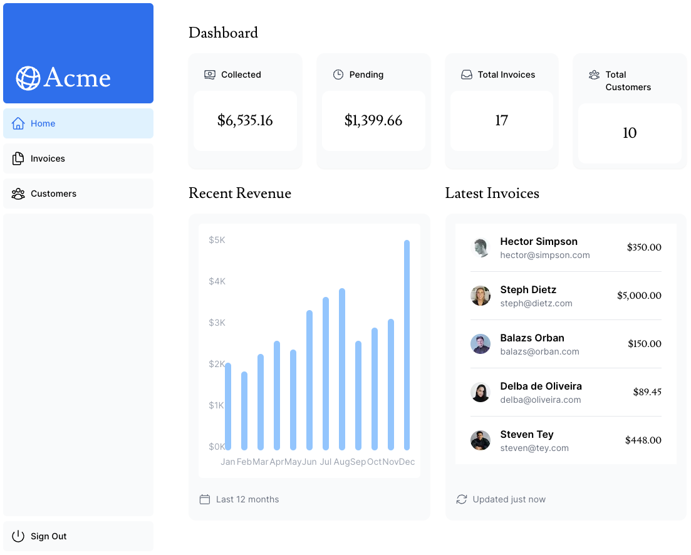
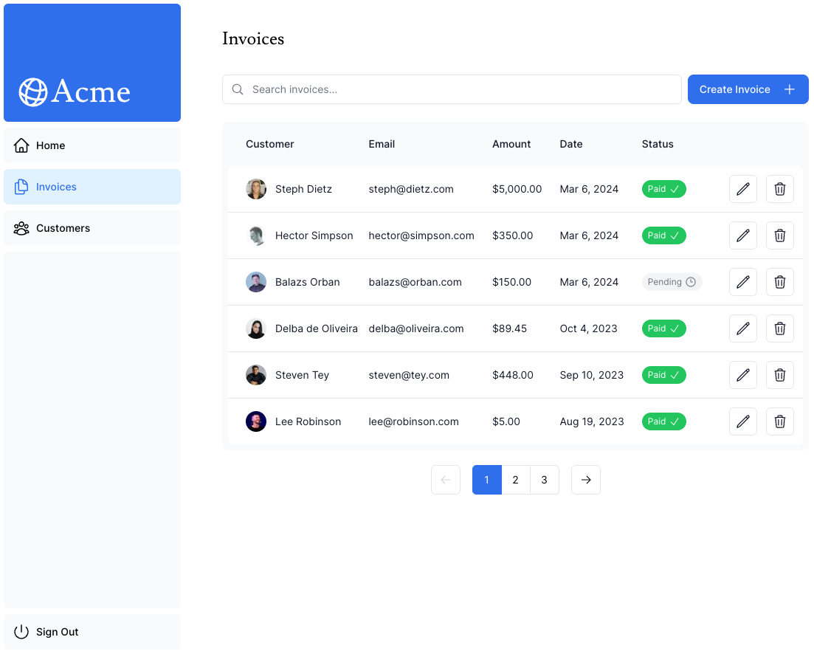
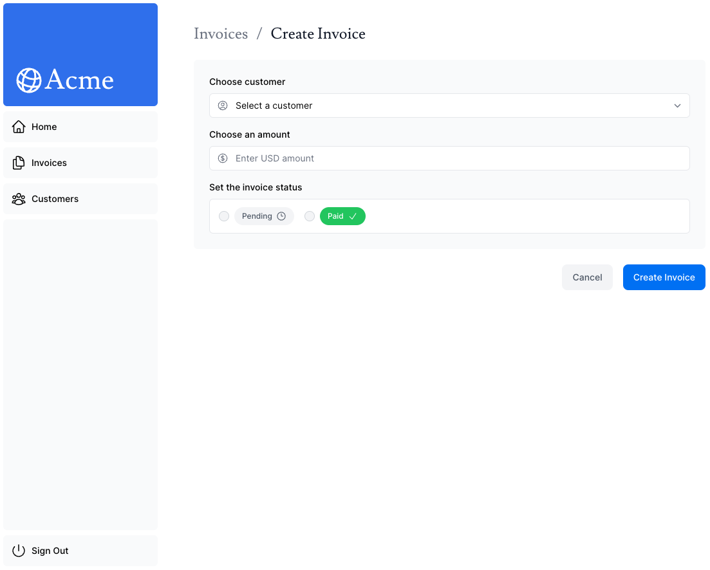
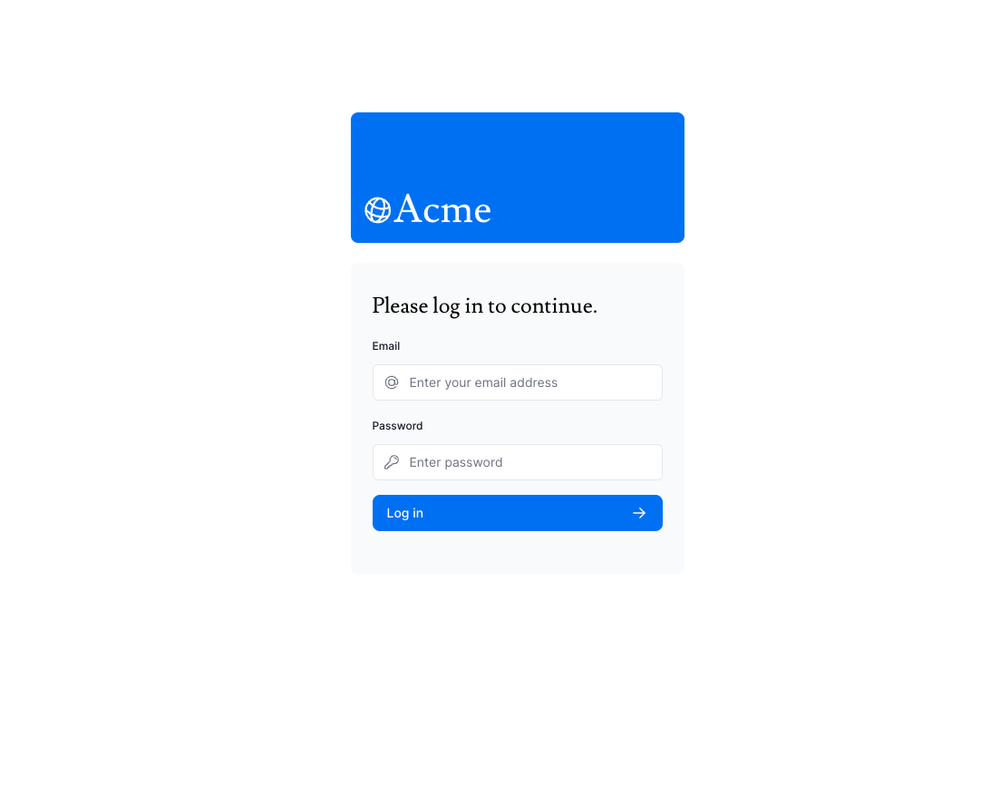

# Next.js Dashboard
A sample project to test and learn about Next.js

## Core technologies
<table>
  <thead>
    <tr align="left">
      <th>#</th>
      <th>Tech</th>
    </tr>
  </thead>
  <tbody align="left">
    <tr>
      <td>01</td>
      <td>Typescript</td>
    </tr>
    <tr>
      <td>02</td>
      <td>React</td>
    </tr>
    <tr>
      <td>03</td>
      <td>Next.js</td> 
    </tr>
    <tr>
      <td>04</td>
      <td>Tailwind CSS</td>
    </tr>
     <tr>
      <td>05</td>
      <td>Node.js</td>
    </tr>
    <tr>
      <td>06</td>
      <td>PostgreSQL</td>
    </tr>
    <tr>
      <td>07</td>
      <td>Zod</td>
    </tr>
  </tbody>
  <tfoot></tfoot>
</table>

## Screenshots

### Dashboard

### Invoices

### Create Invoice

### Login
